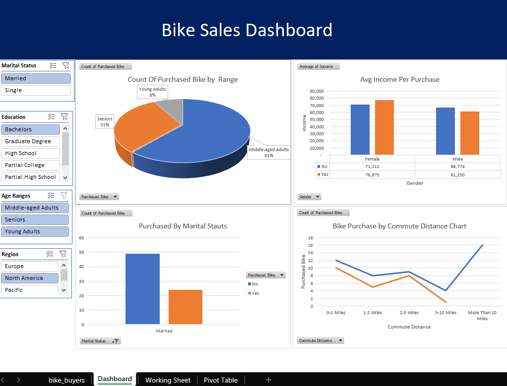

# Data Analytics For Bike Sales

## Data Review:

Initial Analysis: I began by thoroughly reviewing the dataset to understand its structure, content, and the context of the data. This initial overview helped in identifying key variables and the overall quality of the data.
Data Cleaning:

## Removing Duplicates: I removed any duplicate records to ensure the integrity of the data and avoid redundant analysis.
Standardization: I standardized rows and columns to ensure consistency across the dataset. This included aligning formats and correcting any discrepancies.
Data Correction:

## Error Handling: I identified and replaced incorrectly formatted or poorly written data entries to improve data accuracy.
Age Column Transformation: The age column contained inconsistent entries. I created a new column to categorize ages into meaningful ranges, simplifying the analysis and interpretation of age-related data.
Data Analysis:

## Pivot Tables: I utilized pivot tables to summarize and analyze the data effectively. This step allowed for dynamic data aggregation and comparison based on different criteria.
Dashboard Creation: To present the analysis results clearly, I created a dashboard. This visual representation facilitated easy interpretation of the data and provided insights at a glance.

## Dashboard Overview

Here's a quick look at the dashboard:

